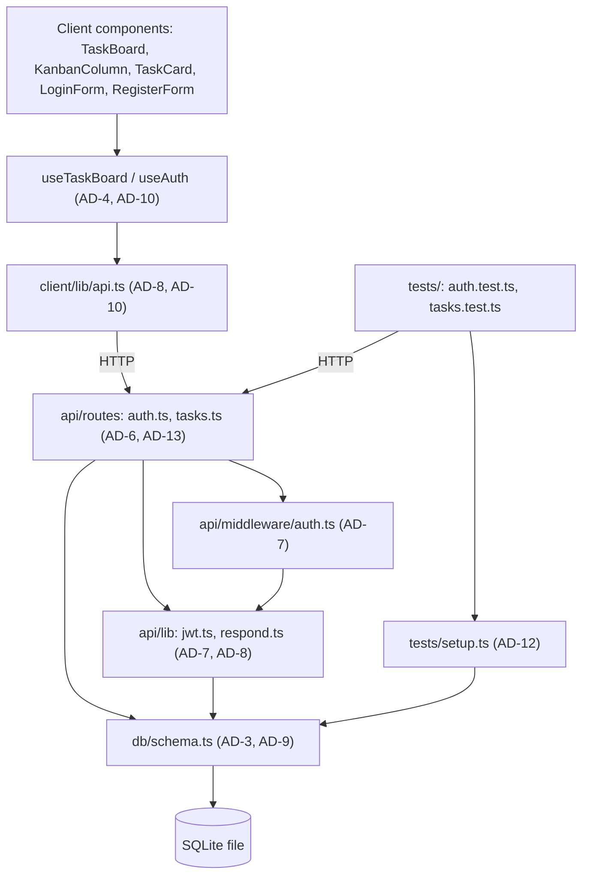
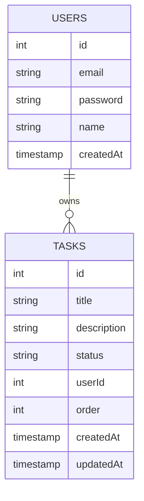

# Architecture Spine — TaskFlow

## Design Paradigm

Classic three-tier layered monolith — `src/client` (presentation) → `src/api/routes` + `src/api/middleware` (application) → `src/api/lib` + `src/db` (domain/data) — with one additional axis overlaid: each layer, plus a `_bmad-output/implementation-artifacts/` control layer, is sharded to exactly one of 5 dispatch roles (Scrum Master, DB Engineer, Backend Dev, Frontend Dev, Integrator). The sharding is what makes parallel subagent dispatch safe; the layering is what keeps each shard internally coherent.

## Invariants & Rules

### AD-1 — File ownership boundaries

- **Binds:** all
- **Prevents:** parallel subagents overwriting or conflicting on each other's files
- **Rule:** `[ADOPTED]` Scrum Master writes only in `_bmad-output/implementation-artifacts/`; DB Engineer only in `src/db/`; Backend Dev only in `src/api/`; Frontend Dev only in `src/client/` (including `lib/api.ts`); Integrator only in `tests/` and `.env`. No agent writes outside its own scope, ever.

### AD-2 — Wave-gated delivery with per-wave PR

- **Binds:** CAP-8, all stories
- **Prevents:** a broken wave's contract silently breaking the next wave's assumptions; unreviewed work compounding across waves
- **Rule:** `[ADOPTED]` Each story runs through 5 sequential waves — 1 Scrum Master, 2 DB Engineer, 3 Backend Dev (+ parallel pure-UI Frontend sub-units), 4 Frontend Dev, 5 Integrator. Each wave's diff passes `bmad-code-review` and lands its own PR before the next wave dispatches.

### AD-3 — SQLite access via better-sqlite3

- **Binds:** `src/db/`, all Backend queries (CAP-1..7)
- **Prevents:** mixed sync/async DB access patterns across independently-dispatched Backend sub-units
- **Rule:** All DB access goes through `drizzle-orm`'s `better-sqlite3` driver.

### AD-4 — Shared `useTaskBoard` hook

- **Binds:** CAP-4, CAP-5, all Frontend Dev sub-units touching the board
- **Prevents:** two independently-dispatched Frontend stories (e.g. board view vs. drag-and-drop) each inventing their own local task-list state, causing duplicate or divergent state management — and, since AD-1 shards by directory not by file, two such stories both authoring `useTaskBoard.ts` in the same wave
- **Rule:** `TaskBoard`, `KanbanColumn`, and `TaskCard` consume task state exclusively through one shared `src/client/hooks/useTaskBoard.ts`, with this exact exported signature:
  ```ts
  function useTaskBoard(): {
    tasksByStatus: Record<"todo" | "in_progress" | "done", Task[]>;
    isLoading: boolean;
    createTask: (title: string, description?: string | null) => Promise<void>;
    updateTask: (id: number, patch: { title?: string; description?: string | null }) => Promise<void>;
    moveTask: (id: number, status: "todo" | "in_progress" | "done", order: number) => Promise<void>;
    deleteTask: (id: number) => Promise<void>;
  }
  ```
  No component fetches or holds its own parallel copy of task state. Each same-role shared file (`useTaskBoard.ts`, and likewise `api.ts`, `respond.ts`, `setup.ts` under AD-8/AD-12) has exactly one authoring sub-unit — the first story that needs it creates it against this pinned signature; every later story that touches the same file is sequenced within its wave (not parallel-dispatched against it) or merged into one dispatch, per epics-to-agents-handoff.md's same-directory-parallelism guidance.

### AD-5 — Task ordering via gap-based integers

- **Binds:** CAP-3, CAP-5
- **Prevents:** Backend and Frontend disagreeing on move/reindex semantics; O(n) reindex storms on every move; undefined behavior once gaps are exhausted; client and server disagreeing on sort order
- **Rule:** `order` values are spaced in increments of 1000 within each status column. Inserting or moving a task sets its `order` to the midpoint between its new neighbors (or ± 1000 at a list boundary). If the gap between neighbors is less than 2 (no integer midpoint exists), that one column is locally reindexed to multiples of 1000 before the move is applied — the sole permitted exception, always scoped to the single affected column, never the whole board. Sort order is server-authoritative: `GET /api/tasks` returns tasks pre-sorted by `(status, order, id)`; the client renders in returned order and never re-sorts client-side.

### AD-6 — Routes call Drizzle directly

- **Binds:** all Backend Dev sub-units (CAP-1..7)
- **Prevents:** parallel Backend dispatches inventing incompatible layering (some adding a services layer, others not)
- **Rule:** Route handlers in `src/api/routes/` import the Drizzle schema/client directly and query inline. No `src/api/services/` or `repositories/` layer.

### AD-7 — Auth via jose + single verification middleware

- **Binds:** CAP-1, CAP-2, all protected routes
- **Prevents:** each route re-implementing its own token signing/verification logic differently; routes disagreeing on how the authenticated user's identity is attached to the request
- **Rule:** `[ADOPTED]` JWT sign/verify goes through `src/api/lib/jwt.ts` using `jose` exclusively. All protected routes are gated by the single `src/api/middleware/auth.ts` — no route hand-rolls its own verification. The middleware attaches the authenticated user's id as `req.userId: number`; every downstream route reads `req.userId` and never re-decodes the token itself.

### AD-8 — Shared response-envelope helper

- **Binds:** all API responses (CAP-1..7), all Frontend API consumers
- **Prevents:** routes or client calls implementing the `{data}`/`{error}` shape by hand each time, letting an inconsistent shape or ad hoc status codes slip through
- **Rule:** `[ADOPTED]` Backend responses are wrapped by one helper (`src/api/lib/respond.ts`: `ok(data)` / `fail(error)`). `src/client/lib/api.ts` unwraps every response through one shared parsing function, never inline per call. `error` is always a plain string (no nested object — this app's scope doesn't need field-level error detail). HTTP status codes are fixed per case: `400` validation, `401` missing/invalid auth, `403` forbidden, `404` not found, `409` conflict (e.g. duplicate email); `422` is not used.

### AD-9 — Synchronous `db.transaction` callbacks

- **Binds:** `src/db/`, `src/api/` (any multi-statement write)
- **Prevents:** an `async` transaction callback throwing at runtime (`better-sqlite3` requires sync callbacks); inconsistent transaction style between DB Engineer's and Backend Dev's independent work
- **Rule:** Every `db.transaction(cb)` callback is a plain synchronous function — never `async`, never returns a Promise, never awaits inside.

### AD-10 — JWT token handoff convention

- **Binds:** CAP-1, CAP-2, all authenticated requests
- **Prevents:** `useAuth` and `api.ts` — both Frontend Dev, but possibly written by different per-story dispatches (AD-4's single-authoring-sub-unit rule covers same-file collisions; this AD covers the two *different* files staying in agreement) — independently choosing different storage keys or mechanisms for the token
- **Rule:** The JWT is stored under the fixed key `taskflow_token` in `localStorage`. `src/client/hooks/useAuth.ts` is the sole writer (sets on login/register success, clears on logout); `src/client/lib/api.ts` is the sole reader (attaches `Authorization: Bearer <token>` to every request).

### AD-11 — Canonical Task DTO

- **Binds:** CAP-3..7, all Backend responses and Frontend consumers
- **Prevents:** Backend and Frontend independently defining slightly different Task shapes (field casing, optional vs. nullable, date format); one story storing an empty description as `null` and another as `""` or omitting it; create/update request bodies going ungoverned
- **Rule:** Every Task returned over the API matches exactly: `{ id: number, title: string, description: string | null, status: "todo" | "in_progress" | "done", order: number, userId: number, createdAt: string, updatedAt: string }` — camelCase, dates as ISO 8601 strings. Defined once and imported, never redefined per component. An empty or absent description is canonicalized to `null` end-to-end — in the stored row, the response, and any request body — never `""` and never an omitted key. Request bodies are fixed: create is `{ title: string, description?: string | null }`; update is `{ title?: string, description?: string | null }`.

### AD-12 — Shared test harness

- **Binds:** `tests/` (Integrator sub-units)
- **Prevents:** each story's tests reinventing setup/teardown (test DB seeding, auth fixtures), causing drift and duplicate boilerplate
- **Rule:** All tests import shared setup from `tests/setup.ts` (test DB init/teardown, an authenticated-request helper). No test file hand-rolls its own DB reset or login flow.

### AD-13 — Canonical Auth response DTO

- **Binds:** CAP-1, CAP-2
- **Prevents:** register and login returning different payload shapes, leaving `useAuth` to guess which fields exist; `password` leaking into a response
- **Rule:** Both `POST /api/auth/register` and `POST /api/auth/login` return the identical shape: `{ data: { token: string, user: { id: number, email: string, name: string } } }`. `password` is never included in any response. `useAuth` always destructures `{ token, user }` from both endpoints the same way.



## Consistency Conventions

| Concern | Convention |
| --- | --- |
| Naming (entities, files, interfaces, events) | camelCase for TS identifiers/fields; PascalCase for React component files (`.tsx`); route paths plural nouns (`/api/tasks`); authenticated user id on the request is always `req.userId` (AD-7) |
| Data & formats (ids, dates, error shapes, envelopes) | Integer autoincrement ids; ISO 8601 date strings over the wire; `{data}`/`{error}` envelope with fixed status-code taxonomy (AD-8); canonical Task DTO with `description` always `null` when empty (AD-11); canonical Auth DTO (AD-13) |
| State & cross-cutting (mutation, errors, logging, config, auth) | Auth via `jose` (AD-7), token at `taskflow_token` (AD-10); DB writes via sync transactions (AD-9); Express routes wrap async handlers in try/catch, map errors to the fixed HTTP status + `{error}` (AD-8); CORS restricted to `http://localhost:5173`; board state via `useTaskBoard` (AD-4), server-authoritative sort order (AD-5) |

## Stack

| Name | Version |
| --- | --- |
| React / react-dom | 19.2.7 |
| Vite | 8.1.5 |
| TypeScript | 6.x (strict mode) — deliberate hold-back: 7.0 (Go-native compiler) GA'd 2026-07-09, 10 days before this spine; 6.x kept as the mature line until 7.0's toolchain (ts-node/loaders) matures |
| Tailwind CSS | 4.3.2 |
| shadcn/ui CLI | v4, Radix primitives (verify exact flag spelling against `shadcn init --help` at use — Base UI is now the CLI default, so an explicit Radix selector is required either way) |
| Node.js | ≥22 (LTS) |
| Express | 5.2.1 |
| Drizzle ORM | 0.45.2 |
| better-sqlite3 | 12.11.1 |
| jose | 6.2.3 |
| bcrypt | 6.0.0 |

## Structural Seed

```text
taskflow/
  src/db/        # DB Engineer — schema.ts, migrate.ts, seed.ts, index.ts
  src/api/       # Backend Dev — index.ts, routes/, middleware/, lib/
  src/client/    # Frontend Dev — components/, hooks/, lib/ (incl. api.ts), styles/
  tests/         # Integrator — + .env
  _bmad-output/implementation-artifacts/  # Scrum Master
```



## Capability → Architecture Map

| Capability / Area | Lives in | Governed by |
| --- | --- | --- |
| CAP-1 Register | `src/api/routes/auth.ts`, `src/client/components/RegisterForm.tsx` | AD-7, AD-8, AD-10, AD-13 |
| CAP-2 Login | `src/api/routes/auth.ts`, `src/client/components/LoginForm.tsx` | AD-7, AD-8, AD-10, AD-13 |
| CAP-3 Create task | `src/api/routes/tasks.ts`, `src/client/components/TaskBoard.tsx` | AD-5, AD-6, AD-8, AD-11 |
| CAP-4 View board | `src/client/components/TaskBoard.tsx`, `KanbanColumn.tsx` | AD-4, AD-11 |
| CAP-5 Move task | `src/api/routes/tasks.ts` (`PATCH /move`), board hooks/components | AD-4, AD-5, AD-6, AD-8 |
| CAP-6 Edit task | `src/api/routes/tasks.ts`, `TaskCard.tsx` | AD-6, AD-8, AD-11 |
| CAP-7 Delete task | `src/api/routes/tasks.ts`, `TaskCard.tsx` | AD-6, AD-8 |
| CAP-8 Parallel agent-team delivery | process, not code | AD-1, AD-2 |

## Deferred

- **Deployment & environments, infra/provider strategy, operations** — non-goal per `SPEC-taskflow` (no CI/CD or production deployment pipeline); local dev only. Revisit if that non-goal changes.
- **Real-time / multi-user collaboration** — non-goal per `SPEC-taskflow`.
- **OAuth/SSO, password reset, email verification** — non-goal per `SPEC-taskflow`; auth stays register/login only.
- **User-defined columns** — non-goal per `SPEC-taskflow`; status stays fixed to `todo`/`in_progress`/`done`.
- **Mobile app / offline support** — non-goal per `SPEC-taskflow`.
- **Rate limiting / brute-force protection on auth endpoints** — not addressed by the source docs; local single-user scale. Revisit if exposed beyond `localhost`.
- **Logging/observability strategy** — not specified; console-level only assumed for local dev. Revisit if that changes.
